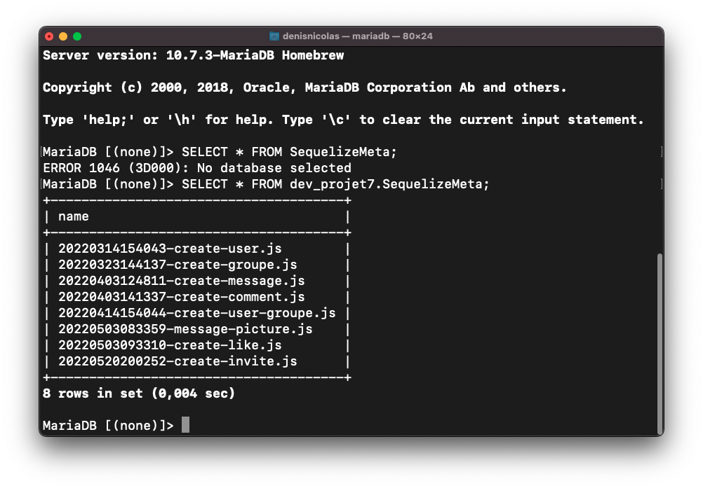
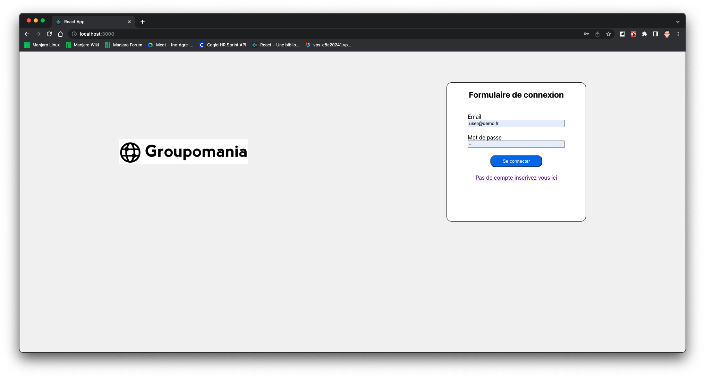
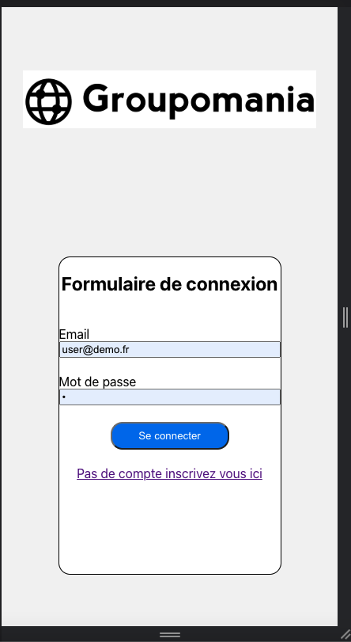
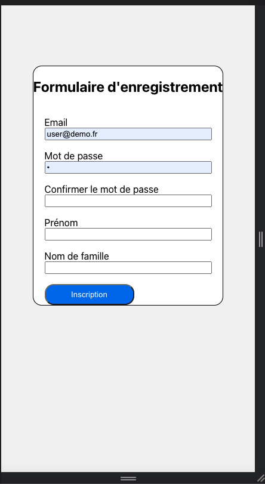
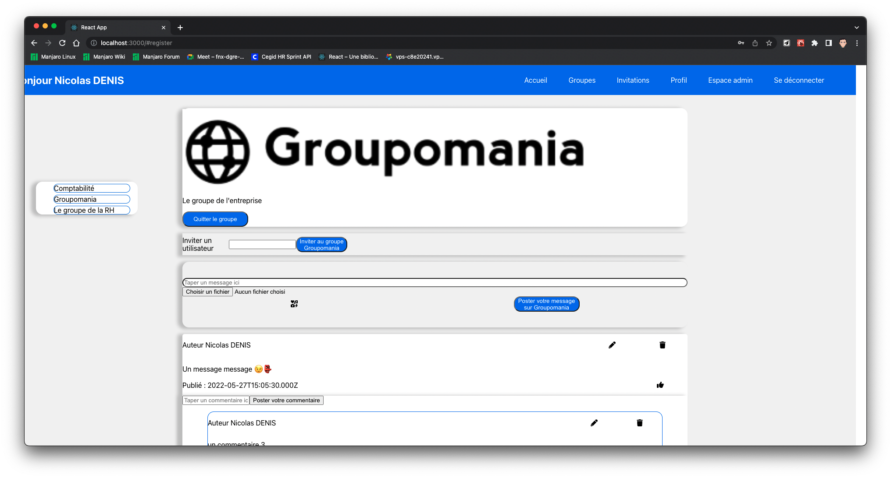
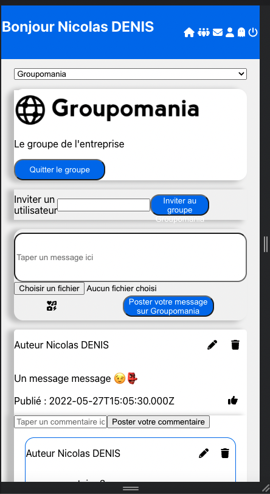

# Projet 7 du parcours developpeur web OpenClassRooms #

## Prérequis ##

Pour le bon fonctionnement de l'application vous devez disposer des prérequis :

- NodeJS 16
- MariaDB

## Liste des dépendances ##

### API ###

```json
 "dependencies": {
    "bcrypt": "^5.0.1",
    "cookie-parser": "^1.4.6",
    "dotenv": "^16.0.0",
    "express": "^4.17.3",
    "jsonwebtoken": "^8.5.1",
    "mariadb": "^3.0.0",
    "multer": "^1.4.4",
    "sequelize": "^6.17.0"
  }
```

### Front ###

```json
 "dependencies": {
    "@fortawesome/fontawesome-svg-core": "^6.1.1",
    "@fortawesome/free-solid-svg-icons": "^6.1.1",
    "@fortawesome/react-fontawesome": "^0.1.18",
    "@testing-library/jest-dom": "^5.16.2",
    "@testing-library/react": "^12.1.4",
    "@testing-library/user-event": "^13.5.0",
    "emoji-picker-react": "^3.5.1",
    "react": "^17.0.2",
    "react-dom": "^17.0.2",
    "react-paginate": "^8.1.3",
    "react-responsive": "^9.0.0-beta.6",
    "react-scripts": "5.0.0",
    "sass": "^1.49.9",
    "web-vitals": "^2.1.4"
  },
```

## Installation du projet ##

Télécharger le code source

```bash
git clone https://github.com/Fibre44/DENISNicolas_7_14032022.git
```

Placez  vous dans le repértoire API

```bash
cd api
```

Puis lancer la commande

```bash
npm install
```

### Configuration de Sequelize ##

Pour toute information sur l'ORM sequelize vous pouvez consulter la documentation sur :  [Sequelize](https://sequelize.org).

Dans db/config.json.dist~ vous devez editer le fichier **puis le sauvegarder sous config.json**.

Exemple avec mariadb:

```json
{
  "development": {
    "username": "user",
    "password": "password",
    "database": "database",
    "host": "127.0.0.1",
    "dialect": "mariadb",
    "seederStorage": "json",
    "seederStoragePath": "sequelizeData.json",
    "seederStorageTableName": "sequelize_data"
  },
  "test": {
    "username": "root",
    "password": null,
    "database": "database_test",
    "host": "127.0.0.1",
    "dialect": "mysql"
  },
  "production": {
    "username": "root",
    "password": null,
    "database": "database_production",
    "host": "127.0.0.1",
    "dialect": "mysql"
  }
}
```

Pour créer les tables de dans la base de données

```bash
npx sequelize-cli db:migrate
```

Sequelize sauvegarde l'historique des imports dans la table SequelizeMeta



Pour intégrer les seeders

```bash
  npx sequelize-cli db:seed:all
```

L'historique de l'intégration des seeders se trouve à la racine du dossier api dans le fichier sequelizeData.json

```json
[
  "20220411192741-group.js",
  "20220503091218-demo-user.js"
]
```

Le seeder group va créer le groupe par default Groupomania et demo-user va insérer le compte utilisateur root.

### Gestion des variables d'environnement ###

Afin de sécuriser les tokens d'authentication vous devez éditer le fichier ~.env.dist en .env

```env
TOKEN="Ma phrase secrete"
```

### Note sur les cookies ###

L'api va envoyer un cookie au frontend afin de gérer l'authentification vous pouvez indiquer le domaine du serveur dans la variable d'environnement la valeur par default est "localhost"

```env
DOMAIN=localhost
```

Pour faciliter la prise en charge de [Postam](https://learning.postman.com/docs/sending-requests/cookies/) en local l'option secure est sur false

Secure - If present, the cookie is only sent when the URL begins with https:// and won't be sent over an insecure connection.

```env
SECURE=false
```

```javascript
  res.cookie('token', jwt.sign(
              { userId: userIdDB },
                token,
              { expiresIn: '24h' }
            ), { httpOnly: true, secure: envSecure, domain: envDomain })
//cookie secure passe sur false car ne fonctionne que sur HTTPS pour postman
```

### Lancement de l'API ###

Pour démarrer l'API lancer une des commandes suivantes :

```bash
  nodemon server
```

Retour de la commande

```bash
denisnicolas@Mac-mini-de-DENIS api % nodemon server
[nodemon] 2.0.15
[nodemon] to restart at any time, enter `rs`
[nodemon] watching path(s): *.*
[nodemon] watching extensions: js,mjs,json
[nodemon] starting `node server.js`
Listening on port 3001
```

```bash
  npm run start
```

Retour de la commande

```bash
denisnicolas@Mac-mini-de-DENIS api % npm run start
> api@1.0.0 start
> node server.js
Listening on port 3001

```

## Installation du frontend ##

**Le frontend utilise la librairie [React](https://fr.reactjs.org)**

Placez  vous dans le repértoire frontend

```bash
cd frontend
```

Puis lancer la commande

```bash
npm install
```

## Note dans le package.json utilisation du proxy ##

Dans package.json l'application utilise le proxy de React pour rediriger les requetes vers l'api

```json
"proxy": "http://localhost:3001"
```

Pour lancer le serveur de developpement React

```bash
  npm run start
```

Retour de la commande

```bash
  Local:            <http://localhost:3000>
  On Your Network:  <http://192.168.1.16:3000>

Note that the development build is not optimized.
To create a production build, use npm run build.

assets by path static/js/*.js 3.7 MiB
  asset static/js/bundle.js 3.69 MiB [emitted] (name: main) 1 related asset
  asset static/js/node_modules_web-vitals_dist_web-vitals_js.chunk.js 6.92 KiB [emitted] 1 related asset
asset index.html 1.62 KiB [emitted]
asset asset-manifest.json 458 bytes [emitted]
cached modules 3.23 MiB [cached] 173 modules
runtime modules 31.6 KiB 15 modules
webpack 5.72.0 compiled successfully in 1725 ms
```

Pour build une version à destination d'un environnement de production vous pouvez lancer la commande suivante

```bash
  npm run build
```

Retour de la commande

```bash
The project was built assuming it is hosted at /.
You can control this with the homepage field in your package.json.

The build folder is ready to be deployed.
You may serve it with a static server:

  npm install -g serve
  serve -s build

Find out more about deployment here:
```

Les sources du projets sont dans frontend/build

## Description de l'application ##

## Fonctionnalités ##

- Création d'un compte utilisateur
- Poster des messages et des commentaires
- Gestion des emojis
- Gestion de groupe avec possibilité de créer des groupes privés
- Possibilité d'inviter des utilisateurs à rejoindre un groupe

### Fonctionnement de l'application ###

Sur la page d'accueil s'affiche un formulaire de connexion.

Interface PC/Interface mobile



L'utilisateur peut créer un compte depuis le formulaire ci dessous
Interface mobile

Une fois connecté la page d'accueil affiche le fil d'actualité
Interface PC

Interface PC/Interface mobile

