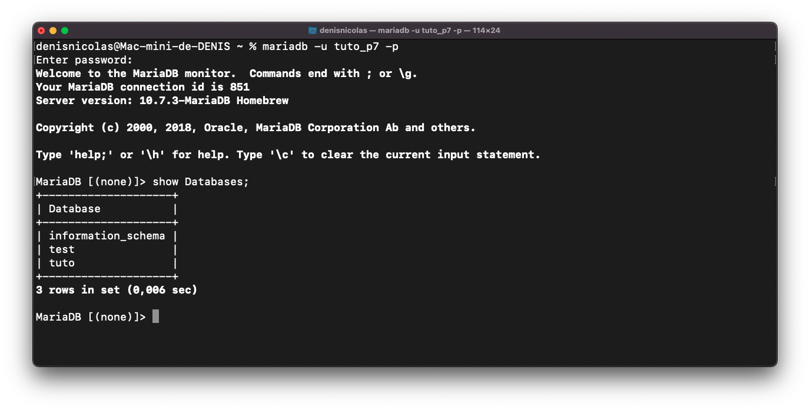

# Projet 7 du parcours developpeur web OpenClassRooms #

## Prérequis ##

Pour le bon fonctionnement de l'application vous devez disposer des prérequis :

- NodeJS 16
- Moteur de base de données MariaDB

## Liste des dépendances ##

### API ###

```json
 "dependencies": {
    "bcrypt": "^5.0.1",
    "cookie-parser": "^1.4.6",
    "dotenv": "^16.0.0",
    "express": "^4.17.3",
    "jsonwebtoken": "^8.5.1",
    "mariadb": "^3.0.0",
    "multer": "^1.4.4",
    "sequelize": "^6.17.0"
  }
```

### Front ###

```json
 "dependencies": {
    "@fortawesome/fontawesome-svg-core": "^6.1.1",
    "@fortawesome/free-solid-svg-icons": "^6.1.1",
    "@fortawesome/react-fontawesome": "^0.1.18",
    "@testing-library/jest-dom": "^5.16.2",
    "@testing-library/react": "^12.1.4",
    "@testing-library/user-event": "^13.5.0",
    "emoji-picker-react": "^3.5.1",
    "react": "^17.0.2",
    "react-dom": "^17.0.2",
    "react-paginate": "^8.1.3",
    "react-responsive": "^9.0.0-beta.6",
    "react-scripts": "5.0.0",
    "sass": "^1.49.9",
    "web-vitals": "^2.1.4"
  },
```

## Description de l'API ##

La description de l'API est disponible sur [Postman](https://documenter.getpostman.com/view/17641464/Uz5DqHeQ).

## Installation du projet ##

Télécharger le code source

```bash
git clone https://github.com/Fibre44/DENISNicolas_7_14032022.git
```

Placez  vous dans le repértoire API.

```bash
cd api
```

Puis lancer la commande

```bash
npm install
```

### Configuration de Sequelize ##

Pour toute information sur l'ORM sequelize vous pouvez consulter la documentation sur :  [Sequelize](https://sequelize.org).

Pour installer Sequelize Cli taper la commande suivante :

```bash
# installe la commande sequelize
$ npm install -g sequelize-cli
```

Par default le projet utilise mariadb avec la librairie associé
```bash
$ npm install --save mariadb
```
Vous pouvez installer un autre moteur de base de données si besoin
```bash
$ npm install --save pg pg-hstore
$ npm install --save mysql 
$ npm install --save mariadb
$ npm install --save sqlite3
$ npm install --save tedious // MSSQL
```

Création de la BDD attention avec mariadb la commande de création depuis Sequelize Cli ne fonctionne pas
```bash
denisnicolas@Mac-mini-de-DENIS api % sequelize db:create
Sequelize CLI [Node: 16.14.0, CLI: 6.4.1, ORM: 6.19.0]
Loaded configuration file "config/config.json".
Using environment "development".
ERROR: Dialect mariadb does not support db:create / db:drop commands
denisnicolas@Mac-mini-de-DENIS api % 
ERROR: Dialect mariadb does not support db:create / db:drop commands
```
Pour créer une base de données sous mariadb depuis le compte root

```bash
mariadb
CREATE DATABASE tuto;
```

Créer un utilisateur avec la commande
```bash
CREATE USER 'tuto_p7'@'localhost' IDENTIFIED BY 'pwd'
```
Puis donner les droits à l'utilisateur d'accéder à la base de données pour l'exemple tuto
```bash
GRANT ALL PRIVILEGES ON tuto.* TO 'tuto_p7'@localhost IDENTIFIED BY 'pwd'
```
On applique les droits
```bash
FLUSH PRIVILEGES;
```
L'utilisateur SQL pourra accéder à la base de données


Dans db/config.json.dist~ vous devez editer le fichier **puis le sauvegarder sous config.json**.

Exemple avec mariadb:

```json
{
  "development": {
    "username": "user",
    "password": "password",
    "database": "database",
    "host": "127.0.0.1",
    "dialect": "mariadb",
    "seederStorage": "json",
    "seederStoragePath": "sequelizeData.json",
    "seederStorageTableName": "sequelize_data"
  },
  "test": {
    "username": "root",
    "password": null,
    "database": "database_test",
    "host": "127.0.0.1",
    "dialect": "mysql"
  },
  "production": {
    "username": "root",
    "password": null,
    "database": "database_production",
    "host": "127.0.0.1",
    "dialect": "mysql"
  }
}
```

Pour créer les tables dans la base de données

```bash
npx sequelize-cli db:migrate
```

Sequelize sauvegarde l'historique des imports dans la table SequelizeMeta


Pour intégrer les seeders

```bash
  npx sequelize-cli db:seed:all
```

L'historique de l'intégration des seeders se trouve à la racine du dossier api dans le fichier sequelizeData.json

```json
[
  "20220411192741-group.js",
  "20220503091218-demo-user.js"
]
```

Le seeder group va créer le groupe par default Groupomania et demo-user va insérer le compte utilisateur root.

### Gestion des variables d'environnement ###

L'application utilise des variables d'environnement pour utiliser les variables avec le deboguer de VS Code il faut créer le fichier .launch.json à la racine de api
```json
{
    // Utilisez IntelliSense pour en savoir plus sur les attributs possibles.
    // Pointez pour afficher la description des attributs existants.
    // Pour plus d'informations, visitez : https://go.microsoft.com/fwlink/?linkid=830387
    "version": "0.2.0",
    "configurations": [
        {
            "console": "integratedTerminal",
            "internalConsoleOptions": "neverOpen",
            "name": "nodemon",
            "program": "${workspaceFolder}/api/server.js",
            "request": "launch",
            "restart": true,
            "runtimeExecutable": "nodemon",
            "skipFiles": [
                "<node_internals>/**"
            ],
            "type": "node",
            "envFile": "${workspaceFolder}/api/.env"
        },
    ]
}
```
Afin de sécuriser les tokens d'authentication vous devez éditer le fichier ~.env.dist en .env

```env
TOKEN="Ma phrase secrete"
```

### Helmet ###

Conformement aux [recommandations](https://expressjs.com/fr/advanced/best-practice-security.html) de Express l'API utilise la librairie Helmet.

Cependant en local l'utilisation de helmet bloque le chargement des images en raison de la violation de la politique CORS.

Afin d'utiliser de déployer l'API en local la variable d'environnement HELMET est sur false par default

```env
HELMET=false
```

```javscript
const envHelmet = process.env.HELMET
//En local helmet bloque le chargement des images car erreur de politique CORS. Le front est sur localhost=3000 mais les images sont sur localhost:3001
if (envHelmet === 'true') {
  const helmet = require('helmet');
  app.use(helmet())
  console.log('Attention Helmet est actif sur le serveur')
} else {
  console.log('Helmet est inactif')
}
```

### Note sur les cookies ###

L'api va envoyer un cookie au frontend afin de gérer l'authentification vous pouvez indiquer le domaine du serveur dans la variable d'environnement la valeur par default est "localhost"

```env
DOMAIN=localhost
```

Pour faciliter la prise en charge de [Postam](https://learning.postman.com/docs/sending-requests/cookies/) en local l'option secure est sur false

Secure - If present, the cookie is only sent when the URL begins with https:// and won't be sent over an insecure connection.

```env
SECURE=false
```

```javascript
  res.cookie('token', jwt.sign(
              { userId: userIdDB },
                token,
              { expiresIn: '24h' }
            ), { httpOnly: true, secure: envSecure, domain: envDomain })
//cookie secure passe sur false car ne fonctionne que sur HTTPS pour postman
```

### Lancement de l'API ###

Pour démarrer l'API lancer une des commandes suivantes :

```bash
  nodemon server
```

Retour de la commande

```bash
denisnicolas@Mac-mini-de-DENIS api % nodemon server
[nodemon] 2.0.15
[nodemon] to restart at any time, enter `rs`
[nodemon] watching path(s): *.*
[nodemon] watching extensions: js,mjs,json
[nodemon] starting `node server.js`
Listening on port 3001
```

```bash
  npm run start
```

Retour de la commande

```bash
denisnicolas@Mac-mini-de-DENIS api % npm run start
> api@1.0.0 start
> node server.js
Listening on port 3001

```

## Installation du frontend ##

**Le frontend utilise la librairie [React](https://fr.reactjs.org)**

Placez  vous dans le repértoire frontend

```bash
cd frontend
```

Puis lancer la commande

```bash
npm install
```

## Note dans le package.json utilisation du proxy ##

Dans package.json l'application utilise le proxy de React pour rediriger les requetes vers l'api

```json
"proxy": "http://localhost:3001"
```

Pour lancer le serveur de developpement React

```bash
  npm run start
```

Retour de la commande

```bash
  Local:            <http://localhost:3000>
  On Your Network:  <http://192.168.1.16:3000>

Note that the development build is not optimized.
To create a production build, use npm run build.

assets by path static/js/*.js 3.7 MiB
  asset static/js/bundle.js 3.69 MiB [emitted] (name: main) 1 related asset
  asset static/js/node_modules_web-vitals_dist_web-vitals_js.chunk.js 6.92 KiB [emitted] 1 related asset
asset index.html 1.62 KiB [emitted]
asset asset-manifest.json 458 bytes [emitted]
cached modules 3.23 MiB [cached] 173 modules
runtime modules 31.6 KiB 15 modules
webpack 5.72.0 compiled successfully in 1725 ms
```

Pour build une version à destination d'un environnement de production vous pouvez lancer la commande suivante

```bash
  npm run build
```

Retour de la commande

```bash
The project was built assuming it is hosted at /.
You can control this with the homepage field in your package.json.

The build folder is ready to be deployed.
You may serve it with a static server:

  npm install -g serve
  serve -s build

Find out more about deployment here:
```

Les sources du projets sont dans frontend/build

## Description de l'application ##

## Fonctionnalités ##

- Création d'un compte utilisateur
- Poster des messages et des commentaires
- Gestion des emojis
- Gestion de groupe avec possibilité de créer des groupes privés
- Possibilité d'inviter des utilisateurs à rejoindre un groupe

### Fonctionnement de l'application ###

Sur la page d'accueil s'affiche un formulaire de connexion.

Interface PC/Interface mobile


L'utilisateur peut créer un compte depuis le formulaire ci dessous
Interface mobile

Une fois connecté la page d'accueil affiche le fil d'actualité
Interface PC

Interface PC/Interface mobile

